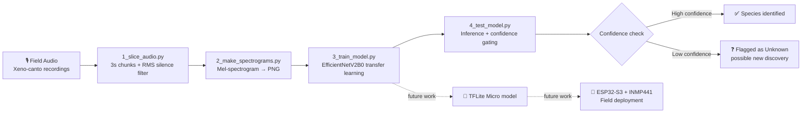

<div align="center">

# Edge AI Bioacoustic Monitoring for Biodiversity Conservation

**Detecting rare and unknown wildlife species by listening, not looking — designed for remote habitats no human survey team can reach.**

🏆 **1st Place — IEEE Sustainathon**

[](https://www.python.org/)
[](https://www.tensorflow.org/)
[](https://librosa.org/)
[]()
[](LICENSE)

</div>

---

## 📖 Overview

Large swaths of the planet's most biodiverse habitats — deep mangrove forests, dense rainforest canopy, unmapped wetlands — are effectively invisible to conservation science simply because no human can safely or affordably survey them on the ground. Species can go undiscovered, or unmonitored to extinction, for exactly that reason.

**Sentinel** is a low-cost, solar-viable, edge-deployable acoustic monitoring device that listens continuously to a habitat and uses an on-device AI model to identify wildlife species from their calls in real time. Instead of requiring a person with a recorder and a trained ear, a single unit can sit in a remote location for months, flagging known species activity and — critically — surfacing **novel or unrecognized calls** that could indicate an undocumented population or an entirely new species.

The idea placed **1st at the IEEE Sustainathon**, and this repository documents the working software prototype built to prove the concept: an end-to-end pipeline that takes raw field recordings and turns them into a trained bird-species classifier, built and validated on 11 real species found in our own region as a testbed before scaling to rarer, harder-to-reach ecosystems.

> 📍 **Current phase:** the classifier below runs and performs well on a desktop/GPU. The active work is re-architecting it into a compact model that can run entirely on a battery-powered **ESP32-S3** microcontroller with an **INMP441** MEMS microphone — turning this from a trained model into a physical field device.

---

## 💡 Why This Matters

- **No ground team required** — passive acoustic monitoring works where camera traps and human surveys can't (dense canopy, dangerous terrain, protected zones).
- **Scales cheaply** — a single ESP32-class device costs a fraction of a satellite tag or a research expedition day.
- **Finds the unexpected** — the same pipeline that recognizes *known* calls can also flag *unrecognized* ones for a researcher to review, turning every deployed unit into a passive discovery tool.
- **Built for the field** — every design choice (see [Model Architecture](#-model-architecture)) accounts for the fact that the final target is a low-power microcontroller in a forest, not a server in a data center.

---

## 🗺️ System Architecture



The pipeline is deliberately split into four independent, single-purpose stages so each one can be re-run, debugged, or swapped out without touching the rest — important when the end goal is to keep iterating on the model architecture for edge deployment.

---

## 🔬 The Pipeline in Detail

### 1. Audio Slicing — [`1_slice_audio.py`](scripts/1_slice_audio.py)
Raw Xeno-canto recordings are long, variable-length MP3s with lots of silence and background noise between calls. This stage:
- Loads each recording at a fixed **22.05 kHz** sample rate for consistency across the whole dataset.
- Slices it into uniform **3-second windows** — long enough to capture a full call phrase, short enough to keep the resulting dataset large and the model input size small.
- Computes the **RMS (root-mean-square) energy** of every window and **discards any slice below a 0.02 threshold**, automatically throwing away silence and near-silent noise floor segments instead of letting them dilute the training set with unlabeled non-calls.

### 2. Spectrogram Generation — [`2_make_spectrograms.py`](scripts/2_make_spectrograms.py)
Audio classification with CNNs works far better as an *image* problem than a raw-waveform problem, so every clean 3-second slice is converted into a **128-bin Mel-spectrogram**, then log-scaled to decibels (`power_to_db`) so quiet harmonics and loud calls are both visible in the same dynamic range. Each spectrogram is saved as a flat PNG (no axes/labels/margins) using the `magma` colormap, which keeps the intensity gradient — and therefore the acoustic information — perceptually easy for the CNN to separate.

<p align="center">
  
  <br/>
  <em>Mel-spectrogram of a Tickell's Blue Flycatcher call — the bright ridges are the bird's call, distinct from the diffuse background texture.</em>
</p>

### 3. Model Training — [`3_train_model.py`](scripts/3_train_model.py)
The spectrogram images are treated as a standard image-classification problem:
- **Backbone:** `EfficientNetV2B0`, pretrained on ImageNet and **fully unfrozen** for full fine-tuning rather than feature extraction — the visual patterns in a spectrogram (harmonic ridges, formant sweeps) are different enough from natural images that letting the whole network adapt outperforms a frozen backbone.
- **Augmentation:** random translation, zoom, and contrast simulate call timing/volume variation, while a `GaussianNoise` layer specifically simulates the background hiss of the low-cost microphone the device will actually use in the field — training the model to be robust to the exact noise profile of its future hardware, not just clean lab recordings.
- **Classification head:** `GlobalAveragePooling2D → Dense(512) → BatchNorm → Dropout(0.4) → Dense(256) → Dropout(0.3) → Dense(num_classes, softmax)`, sized to handle the acoustic complexity of overlapping species calls without overfitting a relatively small dataset.
- **Optimization:** Adam at a low `5e-5` learning rate (appropriate for fine-tuning a pretrained backbone), with `EarlyStopping` and `ReduceLROnPlateau` monitoring validation loss to avoid overtraining.

### 4. Inference & Confidence Gating — [`4_test_model.py`](scripts/4_test_model.py)
The test script doesn't just report the top prediction — it applies a **confidence threshold (35%)** before trusting it. Below that threshold, the result is reported as **"Unknown"** with its closest match shown for reference, rather than forcing a potentially wrong label. This is the mechanism that turns the classifier into a discovery tool in the field: a confidently-unrecognized call is exactly the kind of event a researcher would want flagged for manual review. A dedicated `0_Background` class also lets the model explicitly recognize "no bird, just ambient noise" instead of forcing every 3-second window into a species guess.

---

## 🐦 Species Covered (Prototype Set)

11 species native to our region were chosen as an accessible testbed to validate the full pipeline before targeting rarer species in harder-to-reach habitats, plus a dedicated background/noise class:

<p align="center">
  
</p>

| # | Species |
|---|---|
| 1 | Asian Koel |
| 2 | Common Myna |
| 3 | Coppersmith Barbet |
| 4 | Golden Oriole |
| 5 | Indian Grey Hornbill |
| 6 | Indian Robin |
| 7 | Jungle Crow |
| 8 | Red-vented Bulbul |
| 9 | Shikra |
| 10 | Tickell's Blue Flycatcher |
| 11 | White-throated Kingfisher |
| — | *0_Background (noise / no call)* |

**Dataset:** ~25 recordings per species sourced from [Xeno-canto](https://xeno-canto.org/), a citizen-science library of wildlife audio — sliced into thousands of labeled 3-second training examples by the pipeline above.

---

## 📊 Results

> _Fill in with your actual numbers before publishing — pull these straight from your training run's final epoch / evaluation output._

| Metric | Value |
|---|---|
| Validation accuracy | `92.00%` |
| Validation loss | `0.2261` |
| Classes | 11 species + background |

Consider adding a confusion matrix image and a training curve (accuracy/loss vs. epoch) here — both are easy to generate from the `model.fit()` history object and make this section far more convincing to reviewers.

---

## 🔌 From Model to Field Device

The classifier above was the **proof of concept**. In parallel, the physical sensor node was prototyped:

- **MCU:** ESP32-S3 (TinyML-capable — on-chip AI acceleration, enough RAM/flash for a quantized model)
- **Microphone:** INMP441 I²S MEMS microphone, hand-soldered to the ESP32-S3
- **Status:** hardware assembled and functional; **actively redesigning the model architecture** to fit the constraints of on-device inference

`EfficientNetV2B0` is far too large to run on a microcontroller — the current work is building a **compact CNN** (fewer, smaller layers, potentially depthwise-separable convolutions in a MobileNet-style design) trained on the same 11-species spectrogram pipeline, then converting it via **TensorFlow Lite for Microcontrollers** with post-training quantization, so the entire capture → spectrogram → inference loop runs standalone on the ESP32-S3 in the field, with no cloud or phone connection required.

---

## 🗂️ Repository Structure

```
bird-bioacoustic-monitor/
├── scripts/
│   ├── 1_slice_audio.py         # Raw audio → clean 3s labeled chunks
│   ├── 2_make_spectrograms.py   # Audio chunks → Mel-spectrogram PNGs
│   ├── 3_train_model.py         # Trains the EfficientNetV2B0 classifier
│   └── 4_test_model.py          # Runs inference on a single spectrogram
├── assets/
│   ├── sample_spectrogram.png
│   └── species_folders.png
├── requirements.txt
├── LICENSE
└── README.md
```

> Note: `bird_calls/`, `processed_data/`, `spectrogram_images/`, and the trained `.h5` model are excluded from version control (see `.gitignore`) since they're large, generated artifacts. See [Dataset](#-species-covered-prototype-set) for how to source the raw audio yourself.

---

## ⚙️ Getting Started

```bash
# 1. Clone and install dependencies
git clone https://github.com/<your-username>/bird-bioacoustic-monitor.git
cd bird-bioacoustic-monitor
pip install -r requirements.txt

# 2. Place raw recordings in bird_calls/<species_name>/*.mp3 (one folder per class)

# 3. Run the pipeline in order
python scripts/1_slice_audio.py          # -> processed_data/
python scripts/2_make_spectrograms.py    # -> spectrogram_images/
python scripts/3_train_model.py          # -> bird_monitor_v4_aggressive.h5

# 4. Test on a single spectrogram
python scripts/4_test_model.py
```

---

## 🛣️ Roadmap

- [x] Validate the full pipeline (slicing → spectrograms → classification) on 11 known species
- [x] Confidence-gated inference to flag unrecognized calls
- [x] Assemble ESP32-S3 + INMP441 hardware prototype
- [ ] Design and train a compact, quantization-friendly model architecture
- [ ] Convert to TensorFlow Lite Micro and deploy fully on-device
- [ ] Field-test the standalone unit for continuous, unattended monitoring
- [ ] Extend beyond the 11-species testbed toward rarer, harder-to-survey species

---

## 👥 Team & Acknowledgments

Built by [Your Name] and team, originally pitched and awarded **1st place at the IEEE Sustainathon**. Training audio sourced from the [Xeno-canto](https://xeno-canto.org/) community bird-sound archive.

## 📄 License

Released under the [MIT License](LICENSE).
